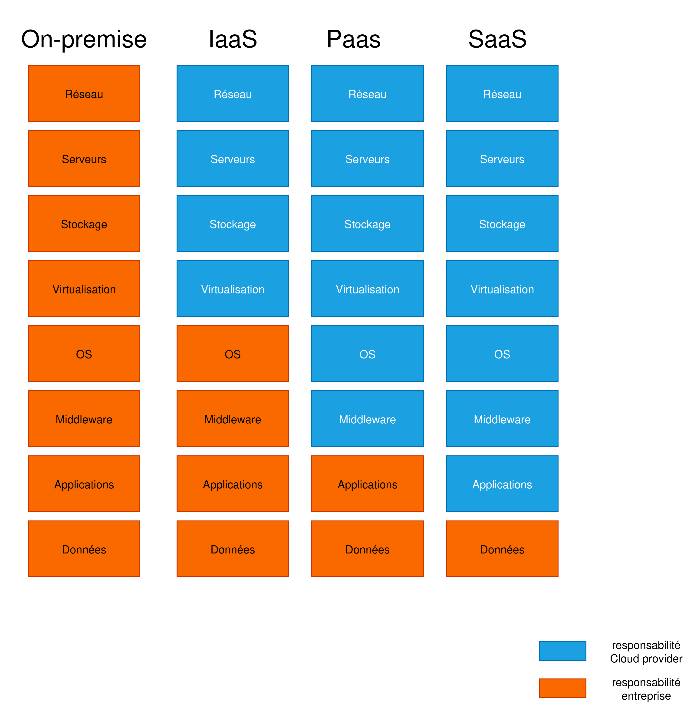

# Linux & Cloud Ops Runbooks

Ce dépôt contient mes scripts, notes et schémas réalisés dans le cadre de mon **programme intensif Cloud & DevOps (4 mois)**.  
Il sert de base de connaissances et de laboratoire pratique autour de **Linux, Réseau, Automatisation et Cloud**.

---

## 📂 Structure du dépôt
- `scripts/` : scripts Bash et Python (gestion utilisateurs, automatisation, diagnostic)
- `cheatsheets/` : fiches pratiques Linux & Réseau (commandes utiles, dépannage)
- `terraform-experiments/` : premiers essais avec Terraform (déploiement d’infra cloud)
- `diagrams/` : schémas explicatifs (Cloud, IaaS vs PaaS vs SaaS, etc.)

---

## 🖼️ Exemple de schéma
Comparaison **On-Prem vs IaaS vs PaaS vs SaaS** :

---

## 🚀 Objectifs
- Consolider mes bases en **administration Linux & Réseau**
- Développer mes compétences en **Infrastructure as Code (Terraform, Ansible)**
- Explorer l’**automatisation avec Python**
- Construire un **portfolio GitHub professionnel** orienté Cloud/DevOps

---

## 📌 Progression
✔️ Semaine 1 : Linux basics + premier schéma Cloud  
⬜ Semaine 2 : Terraform simple VM + Ansible basics  
⬜ Semaine 3 : Python automation + IAM Cloud  
⬜ Semaine 4 : Passage AZ-900/AWS CLF  

*(le README sera mis à jour au fur et à mesure des semaines)*

---

## 🔗 Liens utiles
- [Microsoft Learn – AZ-900](https://learn.microsoft.com/fr-fr/certifications/exams/az-900/)
- [HashiCorp Learn – Terraform](https://developer.hashicorp.com/terraform/tutorials)
- [Linux Journey](https://linuxjourney.com/)
